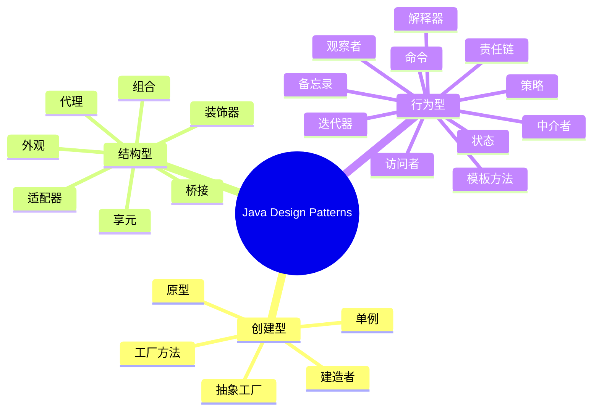

# Java 设计模式实现

本项目按照 GoF 23 种设计模式提供了 Maven 多模块骨架，方便快速补充示例和对比不同实现。本文档为项目导航、分类说明以及如何运行示例提供更加结构化的指引。

## 项目导航与分类



各模式对应的 Maven 子模块以分类分组，便于单独构建与对比：

```
java-design-patterns/
├── creational-patterns/      # 创建型模式聚合模块
├── structural-patterns/      # 结构型模式聚合模块
└── behavioral-patterns/      # 行为型模式聚合模块
```

### 示例建议与落地场景

| 分类 | 典型场景 | 推荐示例 | 模块路径 |
| --- | --- | --- | --- |
| 创建型 | 跨平台 UI 组件、数据源/驱动切换 | 抽象工厂生产不同平台的 Button/Menu；建造者拼装报表或房屋；原型克隆游戏角色或配置模板；单例集中管理配置/连接池 | `creational-patterns/*-pattern` |
| 结构型 | 接口兼容与对象组合 | 适配器兼容旧日志库；桥接拆分消息发送与传输协议；装饰器按需叠加缓存/监控；外观对接第三方支付；享元缓存图标或棋子；代理实现延迟加载或权限校验 | `structural-patterns/*-pattern` |
| 行为型 | 复杂业务流程与算法封装 | 责任链处理审批流程；命令封装可撤销操作；观察者驱动事件通知；策略切换折扣或排序算法；模板方法定义通用步骤；状态机驱动工单/订单流转；解释器解析 DSL；访问者遍历文档/AST | `behavioral-patterns/*-pattern` |

> **说明**：当前仓库提供模式骨架与依赖管理，具体代码示例可按照表格中的业务场景补充。每个 `*-pattern` 子模块都可独立添加 `src/main/java` 与 `src/test/java` 内容后单独构建与运行。

## 快速开始

1. 克隆仓库

   ```bash
   git clone https://github.com/wangguangwu/java-design-patterns.git
   cd java-design-patterns
   ```

2. 构建全部模式骨架

   ```bash
   mvn clean install
   ```

3. 只构建或运行某一模式示例（以单例模块为例）

   ```bash
   mvn -pl creational-patterns/singleton-pattern -am clean test
   # 添加 Main 类后，可通过 exec 插件运行：
   mvn -pl creational-patterns/singleton-pattern exec:java \
     -Dexec.mainClass="com.wangguangwu.singleton.App"
   ```

4. 在新增代码前，可按分类对比不同模式的示例，确保同一业务场景覆盖创建型、结构型与行为型的多种解法，帮助学习者感知模式差异。

## 文档与最佳实践

- 为每个子模块添加模式说明、类图（Mermaid/UML）与输入输出示例。
- Javadoc 注释清晰描述参与者角色（产品、工厂、适配者、上下文等）。
- 单元测试覆盖关键分支，示范常见扩展点与失败路径。
- 遵循 SOLID 原则与统一的包命名（`com.wangguangwu.<pattern>.…`），并可使用 Lombok 减少样板代码。

## 贡献指南

1. Fork 本仓库
2. 创建功能分支 (`git checkout -b feature/你的功能`)
3. 提交更改 (`git commit -m '描述你的改动'`)
4. 推送分支 (`git push origin feature/你的功能`)
5. 发起 Pull Request 合并请求

## 许可协议

本项目基于 MIT 协议开源，详见 [LICENSE](LICENSE) 文件。

## 鸣谢

- 感谢所有为本项目做出贡献的开发者
- 感谢开源社区提供的宝贵资源与灵感
