# 设计模式导航与示例蓝图

本文档对仓库内 23 种设计模式进行分类梳理，提供更贴近业务的示例思路，并用 Mermaid 图帮助快速理解模块结构。

## 模块分组总览

```mermaid
flowchart TB
    root[Java Design Patterns] --> C[creational-patterns]
    root --> S[structural-patterns]
    root --> B[behavioral-patterns]

    C --> C1[abstract-factory-pattern]
    C --> C2[builder-pattern]
    C --> C3[factory-pattern]
    C --> C4[prototype-pattern]
    C --> C5[singleton-pattern]

    S --> S1[adapter-pattern]
    S --> S2[bridge-pattern]
    S --> S3[composite-pattern]
    S --> S4[decorator-pattern]
    S --> S5[facade-pattern]
    S --> S6[flyweight-pattern]
    S --> S7[proxy-pattern]

    B --> B1[chain-of-responsibility-pattern]
    B --> B2[command-pattern]
    B --> B3[interpreter-pattern]
    B --> B4[iterator-pattern]
    B --> B5[mediator-pattern]
    B --> B6[memento-pattern]
    B --> B7[observer-pattern]
    B --> B8[state-pattern]
    B --> B9[strategy-pattern]
    B --> B10[template-pattern]
    B --> B11[visitor-pattern]
```

## 示例设计建议（按分类）

| 模式 | 核心意图 | 更贴近业务的示例思路 | 入口包命名建议 |
| --- | --- | --- | --- |
| 抽象工厂 | 同族产品的创建与切换 | 跨平台 UI 组件、云厂商存储/消息驱动切换 | `com.wangguangwu.factory.ui` / `cloud` |
| 建造者 | 复杂对象分步装配 | 报表构建、套餐/订单组合、游戏角色装备组装 | `com.wangguangwu.builder.report` |
| 工厂方法 | 子类决定实例化 | 日志适配、解析器注册表、任务处理器插件化 | `com.wangguangwu.factory.logger` |
| 原型 | 通过复制生成对象 | 关卡模板克隆、配置快照复制、图形元素拷贝 | `com.wangguangwu.prototype.level` |
| 单例 | 全局唯一实例 | 配置中心、连接池、ID 生成器 | `com.wangguangwu.singleton.config` |
| 适配器 | 接口转换 | 旧版支付/日志 SDK 与新接口兼容 | `com.wangguangwu.adapter.payment` |
| 桥接 | 抽象与实现解耦 | 消息发送（通知类型）× 传输协议（Email/SMS/Webhook） | `com.wangguangwu.bridge.notification` |
| 组合 | 树形层级 | 组织架构、文件系统、菜单节点 | `com.wangguangwu.composite.organization` |
| 装饰器 | 运行时职责叠加 | 服务调用链路上增加缓存/指标/重试 | `com.wangguangwu.decorator.http` |
| 外观 | 统一入口 | 第三方支付/物流/认证聚合 SDK | `com.wangguangwu.facade.payment` |
| 享元 | 共享细粒度对象 | 棋子、地图瓦片、图标缓存 | `com.wangguangwu.flyweight.assets` |
| 代理 | 访问控制/延迟 | 鉴权代理、远程代理、懒加载大对象 | `com.wangguangwu.proxy.auth` |
| 责任链 | 顺序处理 | 审批流、请求过滤器、验证管线 | `com.wangguangwu.chain.approval` |
| 命令 | 请求封装 | 可撤销编辑操作、批处理命令队列 | `com.wangguangwu.command.editor` |
| 解释器 | 简化语法解析 | 规则 DSL、公式引擎、查询过滤器 | `com.wangguangwu.interpreter.rule` |
| 迭代器 | 统一遍历 | 分页 API 聚合、树遍历 | `com.wangguangwu.iterator.collection` |
| 中介者 | 协调同事对象 | 聊天室、事件总线、表单控件联动 | `com.wangguangwu.mediator.chat` |
| 备忘录 | 状态快照 | 文档撤销/重做、游戏存档 | `com.wangguangwu.memento.editor` |
| 观察者 | 事件通知 | 领域事件、监控告警、缓存失效广播 | `com.wangguangwu.observer.event` |
| 状态 | 行为随状态切换 | 订单/工单状态机、播放器播放状态 | `com.wangguangwu.state.order` |
| 策略 | 可替换算法 | 折扣策略、排序/路由策略、风控评分 | `com.wangguangwu.strategy.discount` |
| 模板方法 | 流程骨架固定 | 支付/退款流程、数据导入流程 | `com.wangguangwu.template.payment` |
| 访问者 | 分离操作与结构 | 文档/AST 扫描、报表统计 | `com.wangguangwu.visitor.document` |

## 如何补充或改进示例

1. 在对应 `*-pattern` 模块下创建 `src/main/java` 与 `src/test/java`，使用表格中的命名建议保证可读性。
2. 在 README 中补充 Mermaid 类图或时序图，展示参与者关系与调用链。
3. 用 JUnit 5 添加可运行的演示用例（`@Test` 即可充当示例入口），并在用例中打印关键节点的输出。
4. 对比同一业务场景在多个模式下的实现差异，帮助读者理解适用性与取舍。

以上整理可作为实现参考，后续添加代码时请保持分类与命名一致。
